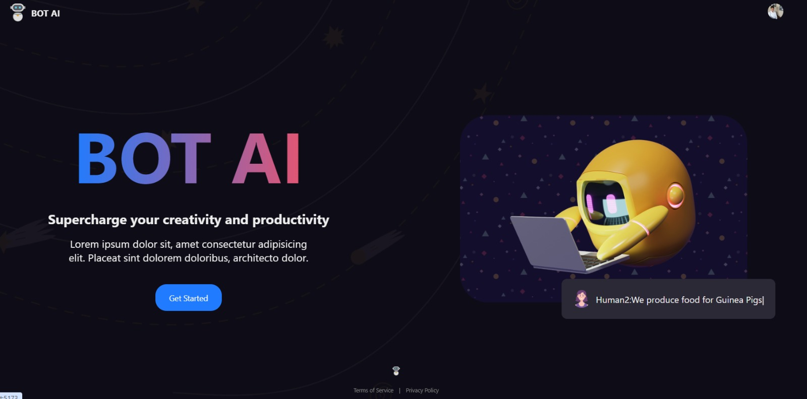
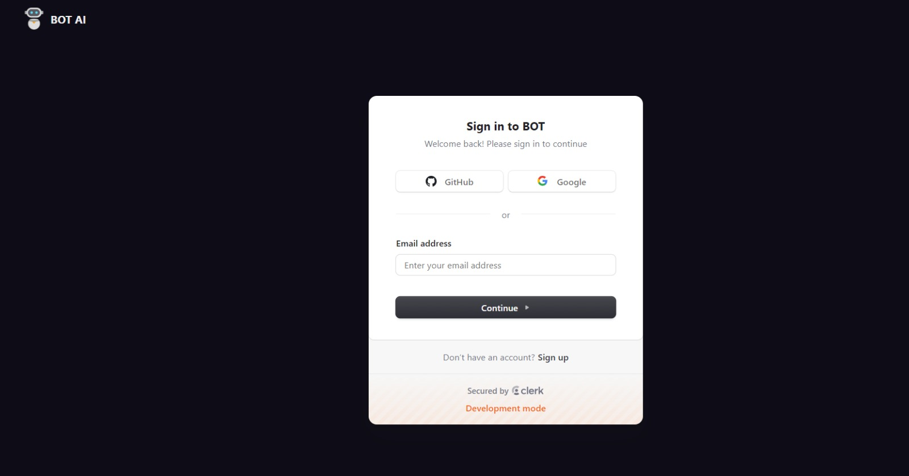
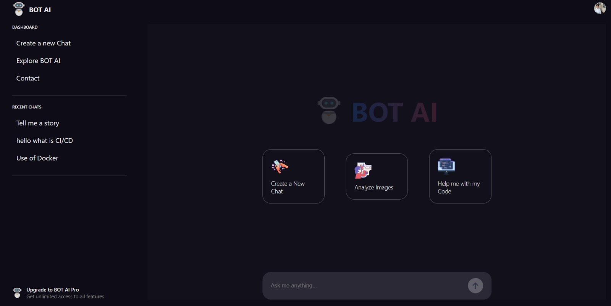
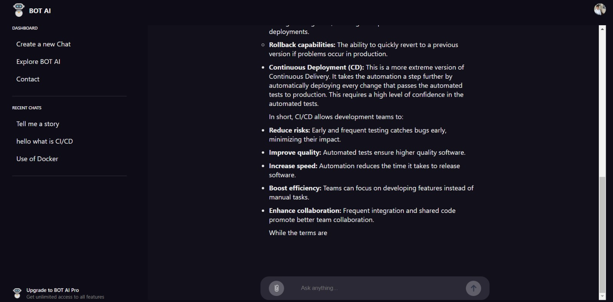

# BOT AI 

BOT AI is a conversational AI platform similar to ChatGPT, built using the MERN stack. It integrates authentication via Clerk, utilizes the Gemini API for enhanced chatbot capabilities, and employs ImageKit.io for image upload functionality. The project is designed to mimic ChatGPT's core features, with real-time chatting and image handling.

---

## **Features**
- **User Authentication**: Implemented using Clerk for secure and seamless sign-in and sign-up.
- **Chat Functionality**: Real-time chat feature resembling ChatGPT's capabilities.
- **Image Upload**: Users can upload and handle images via ImageKit.io integration.

---

## **Project Structure**
```plaintext
.
├── backend
│   ├── models/
│   │   ├── chat.js
│   │   ├── userChats.js
│   ├── index.js
│   ├── .env.example
│   └── package.json
├── client
│   ├── public/
│   │   ├── (screenshots of the app UI)
│   ├── src/
│   │   ├── components/
│   │   ├── routes/
│   ├── App.jsx
│   ├── index.css
│   ├── .env.example
│   └── package.json
```

---

## **Tech Stack**
- **Frontend**: React with Vite for faster builds.
- **Backend**: Node.js and Express.js.
- **Database**: MongoDB for storing user chats and session data.
- **Authentication**: Clerk for managing user sign-in and sign-up.
- **Image Handling**: ImageKit.io for storing and retrieving user-uploaded images.
- **AI API**: Gemini API for chatbot functionality.

---

## **Getting Started**

### **1. Set up Environment Variables**
Ensure that all necessary keys and values are placed in the `.env` files for both the `client` and `backend` folders. Refer to the `.env.example` files for structure.

#### Backend `.env.example`:
```plaintext
IMAGE_KIT_ENDPOINT=<YOUR IMAGE KIT ENDPOINT>
IMAGE_KIT_PUBLIC_KEY=<YOUR IMAGE KIT PUBLIC KEY>
IMAGE_KIT_PRIVATE_KEY=<YOUR IMAGE KIT PRIVATE KEY>
MONGO=<YOUR MONGO CONNECTION STRING>
CLIENT_URL=<YOUR CLIENT URL>
CLERK_PUBLISHABLE_KEY=<YOUR CLERK PUBLISHABLE KEY>
CLERK_SECRET_KEY=<YOUR CLERK SECRET KEY>
```

#### Client `.env.example`:
```plaintext
VITE_CLERK_PUBLISHABLE_KEY=<YOUR CLERK PUBLISHABLE KEY>
VITE_IMAGE_KIT_ENDPOINT=<YOUR IMAGE KIT ENDPOINT>
VITE_IMAGE_KIT_PUBLIC_KEY=<YOUR IMAGE KIT PUBLIC KEY>
VITE_IMAGE_KIT_PRIVATE_KEY=<YOUR IMAGE KIT PRIVATE KEY>
VITE_GEMINI_PUBLIC_KEY=<YOUR GEMINI PUBLIC KEY>
VITE_API_URL=<YOUR API URL>
```

### **2. Backend Setup**
Navigate to the backend folder:
```bash
cd backend
npm install
npm run start
```

### **3. Frontend Setup**
Navigate to the client folder:
```bash
cd client
npm install
npm run dev
```

---

## **Screenshots**
Here are some screenshots of the BOT AI interface:

### **Home Page**


### **Sign-In Page**


### **Dashboard**


### **Chat Page**


---

## **Future Work**
- **Deployment**: 
  - Backend on AWS EC2 server.
  - Frontend hosted on AWS S3 for scalability and reliability.
- **Enhanced Features**: Adding support for more advanced AI capabilities and multilingual support.

---

Feel free to contribute or suggest improvements! 🚀
